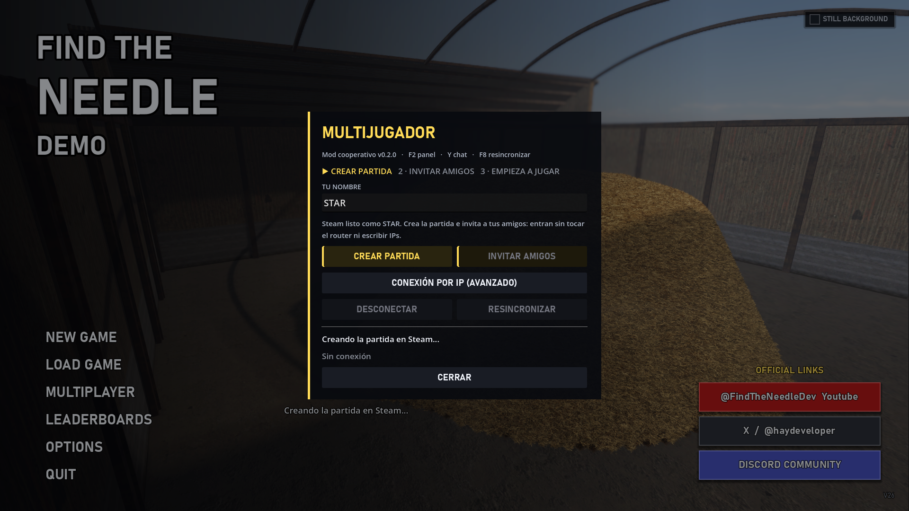

# Find The Needle — Mod multijugador (cooperativo)

Juega a *Find The Needle* (demo de Steam) con tus amigos. Un solo pajar, varios
jugadores, todos cavando a la vez.

La conexión va por la **red de Steam**, igual que en los juegos con cooperativo
oficial: **sin abrir puertos, sin IPs y sin VPN**. Invitas desde la lista de
amigos de Steam y tu amigo aparece en tu patio.

> Mod no oficial. Sin relación con el desarrollador del juego ni respaldo suyo.
> **No incluye ningún archivo del juego**: solo sus propios scripts, que el
> juego carga al arrancar. English: [README.md](README.md)

---

## Requisitos

- *Find The Needle Demo* instalada desde Steam (gratis), versión **V26** o
  posterior.
- Windows 64 bits.
- Todos los jugadores necesitan **la misma versión del mod**.
- Abrid el juego **desde Steam** (las invitaciones necesitan el overlay).

## Instalación

1. Descarga el último `FindTheNeedle_Multiplayer_vX.Y.Z.zip` de
   [Releases](../../releases).
2. Descomprime y copia la carpeta `mods` junto a `FindTheNeedle.exe`
   (Steam → clic derecho en el juego → Administrar → Ver archivos locales).
3. Ejecuta `mods\multiplayer\INSTALAR.bat`.
4. Abre el juego desde Steam. En el menú principal aparece **MULTIPLAYER**.

Para quitarlo, ejecuta `mods\multiplayer\DESINSTALAR.bat`: deja el juego
exactamente como estaba.

> **Después de cada actualización del juego, vuelve a ejecutar `INSTALAR.bat`.**
> Las actualizaciones de Steam sobrescriben `override.cfg`, que es el archivo
> donde se registra el mod.

## Cómo jugar

**Anfitrión** (aquel cuya partida se juega):

1. `MULTIPLAYER` → **CREAR PARTIDA**
2. **INVITAR AMIGOS** (abre el overlay de Steam) o que entren desde tu perfil
   con *Unirse a la partida*.
3. Empieza o carga tu partida como siempre. Tus amigos aparecerán en ella.

**Amigos:** aceptad la invitación de Steam. Ya está, no hay que escribir
ninguna dirección. Si teníais el juego cerrado, Steam lo abre y os mete dentro.

Queda también un modo por IP directa en *Conexión por IP (avanzado)*, por si
algún día falla Steam.

### Teclas

| Tecla | Acción |
|-------|--------|
| `F2` | Panel de multijugador (también dentro de la partida) |
| `Y` | Chat |
| `F8` | Resincronizar el mundo si algo se ve distinto |

## Qué se comparte

- **El pajar.** Todos cavan el mismo montón y lo ven cambiar al momento.
- **Construcciones.** Colocar y derribar edificios, cintas y plataformas.
- **Economía.** Dinero, deuda, paja vendida, agujas encontradas y colección.
- **Árbol de mejoras.** Una mejora comprada por uno la tienen todos.
- **Agujas sueltas.** Las agujas destapadas las ve todo el mundo y solo se
  pueden entregar una vez.
- **Cargas nuevas de paja.** Pedir un montón nuevo resincroniza a todos.
- **Jugadores.** Os veis entre vosotros con el nombre de Steam y la herramienta
  en la mano.

## Limitaciones actuales

- Las máquinas que sacan paja del pajar por su cuenta (rastrillo de pistón,
  brazo robótico, dron, escáner) funcionan **solo en el anfitrión**; en los
  clientes se ven quietas. Es a propósito: evita que la paja y el dinero se
  cuenten dos veces.
- Los objetos sueltos (cubos, sacos, fardos) son de cada jugador.
- Los ajustes de las máquinas (filtros, interruptores) no se comparten.
- Las herramientas compradas son de cada jugador; el dinero es común.
- Solo guarda el anfitrión. Los clientes no tocan sus propias partidas.
- La tabla de clasificación online se desactiva con el mod puesto, así que
  ninguna partida modificada llega a ella.

## Si algo falla

**No aparece MULTIPLAYER** — el juego se actualizó y borró `override.cfg`.
Vuelve a ejecutar `INSTALAR.bat`.

**"Steam no disponible"** — abre el juego desde Steam, no desde el .exe.

**Un amigo no puede entrar** — los dos necesitáis la misma versión del mod; el
panel indica cuál tienes.

**El mundo se ve distinto entre jugadores** — pulsa `F8` para resincronizar.

**Cualquier otra cosa** — abre un [issue](../../issues) con el registro de
`%APPDATA%\Godot\app_userdata\Haystack Incremental\logs\`.

## Privacidad en directo

El panel no muestra nunca IPs, identificadores de Steam ni códigos de sala. Las
direcciones locales solo salen si pulsas *Mostrar mis IPs*, en la parte
avanzada.

## Cómo funciona

La demo viene en un único `.pck` de Godot cifrado, así que el mod no lo toca.
En su lugar:

- **Carga.** Godot lee `override.cfg` al arrancar. El instalador registra ahí
  `mp.gd` como autoload, así que el mod son unos cuantos `.gd` fuera del juego.
- **Steam.** La demo no trae la API de Steam, así que el mod carga la
  GDExtension de [GodotSteam](https://godotsteam.com) en caliente con
  `GDExtensionManager.load_extension()` e inicia Steam con el appid de la demo.
  Eso nos da salas, invitaciones y `SteamMultiplayerPeer`, que hace pasar el
  tráfico por Steam en vez de por una conexión directa.
- **Entrar.** El anfitrión serializa su mundo con la misma forma que usa el
  guardado del juego, lo manda comprimido, y el cliente lo carga con el propio
  cargador del juego en un hueco aparte, sin tocar sus partidas.
- **Mantenerlo sincronizado.** El pajar es un mapa de alturas: cada jugador
  envía los vértices que cambian. Las construcciones se comparan con el
  `to_array()` del propio juego y se recrean con su propio cargador. El dinero
  y los contadores se envían como incrementos, con el anfitrión de árbitro.

Todo se aplica recorriendo el árbol de escena en vivo y llamando a los métodos
del propio juego, así que no se copia ni se redistribuye código del juego.

## Créditos

- Mod de **AleDev11**.
- *Find The Needle*, de [FindTheNeedleDev](https://x.com/haydeveloper).
- [GodotSteam GDExtension](https://godotsteam.com) — MIT.
- Steamworks SDK — © Valve Corporation.

## Licencia

El código propio del mod es MIT: ver [LICENSE](LICENSE). Este repositorio no
contiene recursos ni código del juego.
